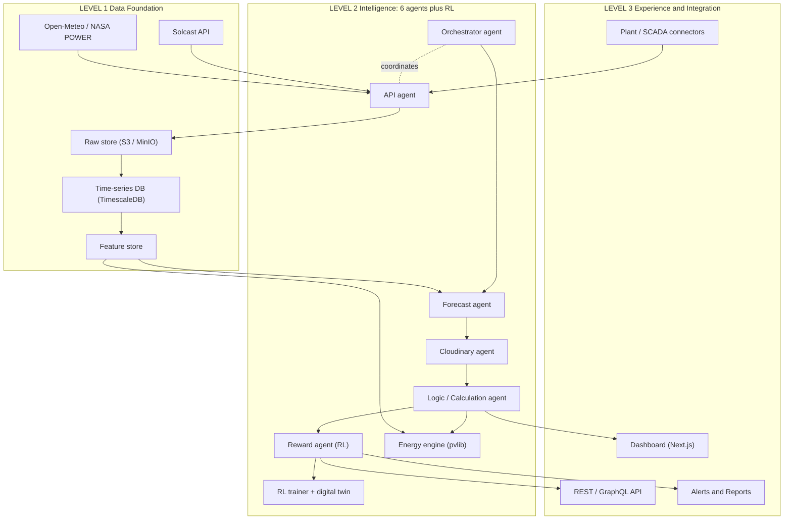
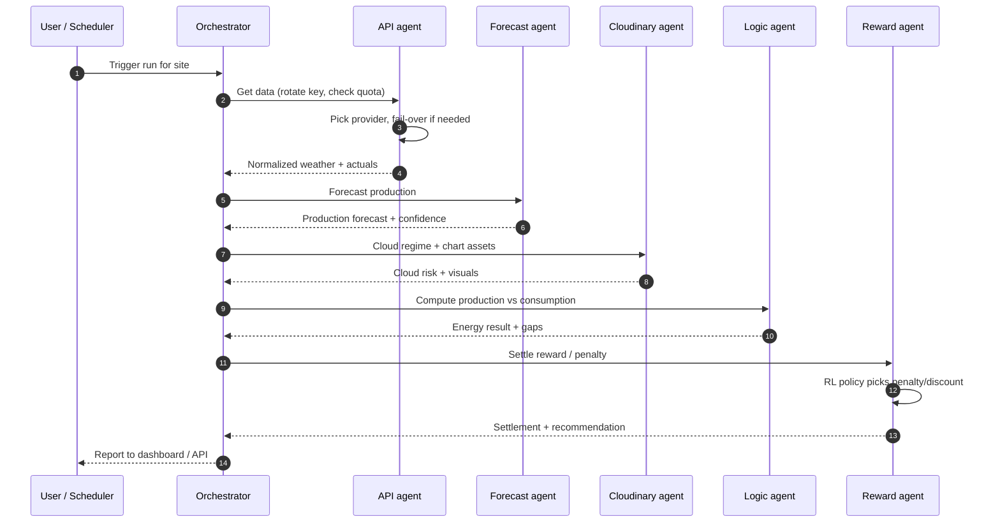
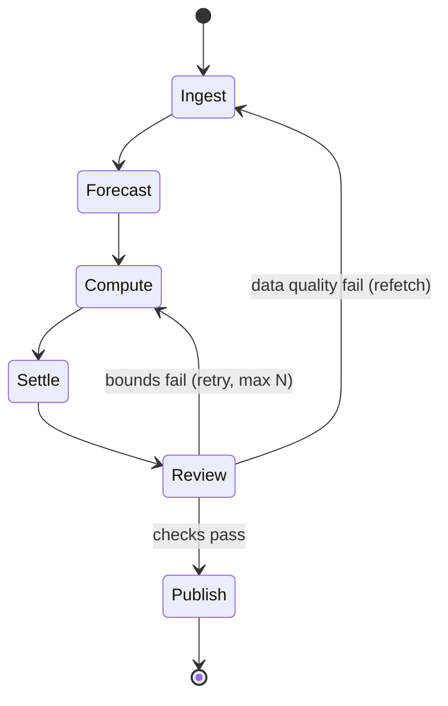
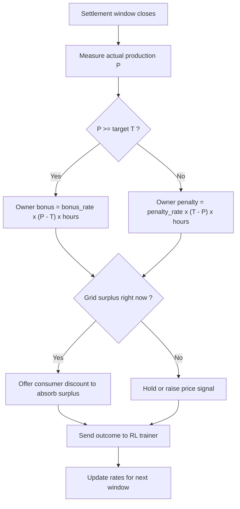
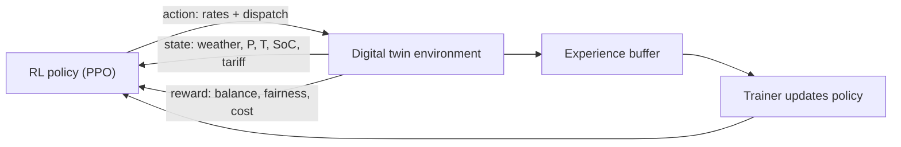
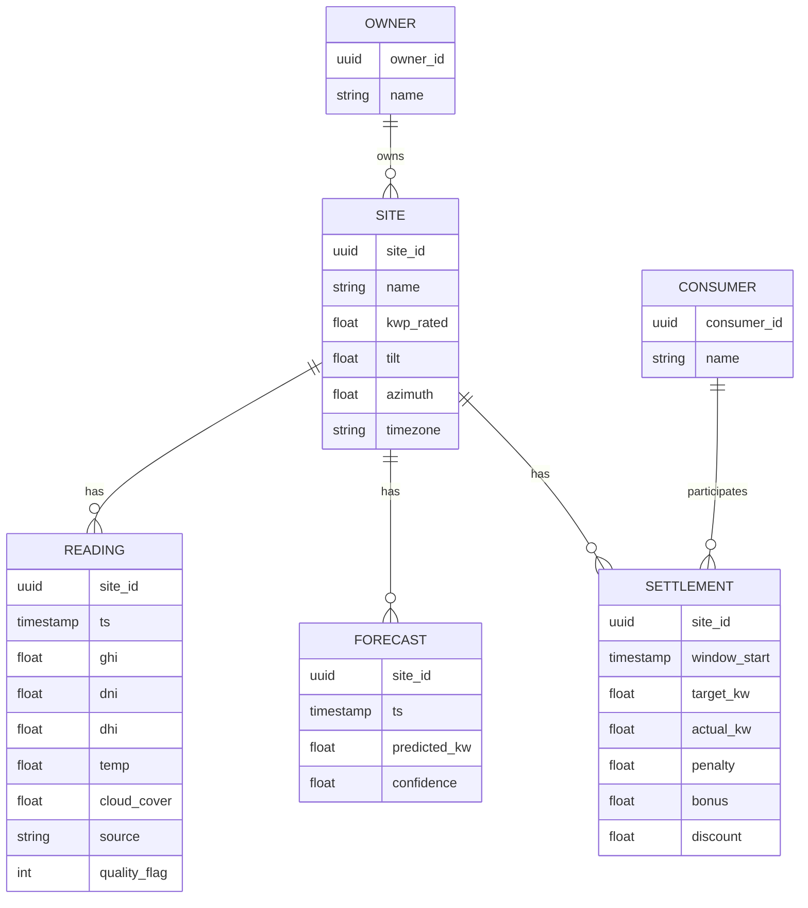
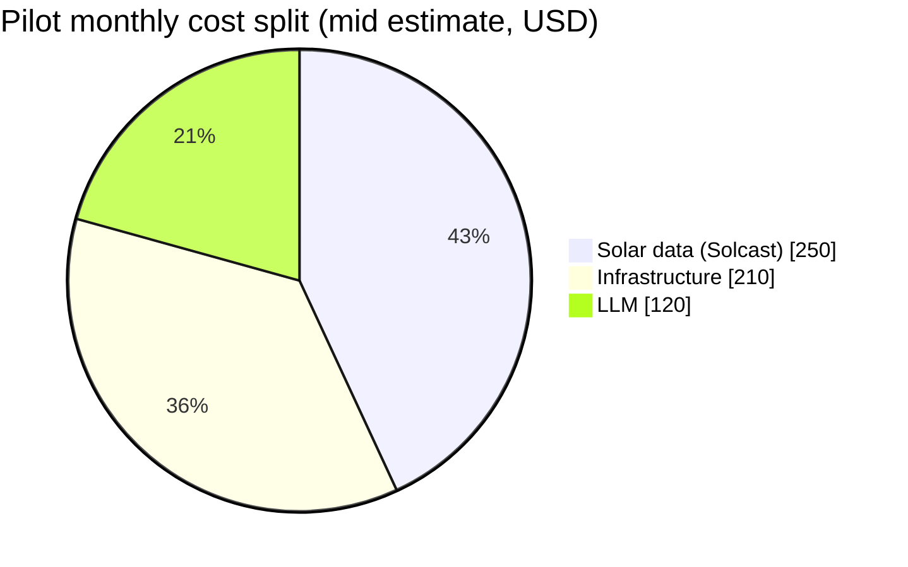
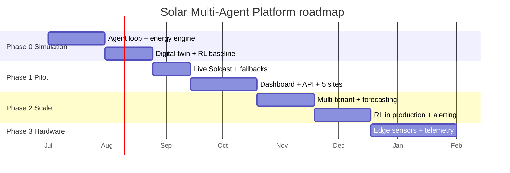
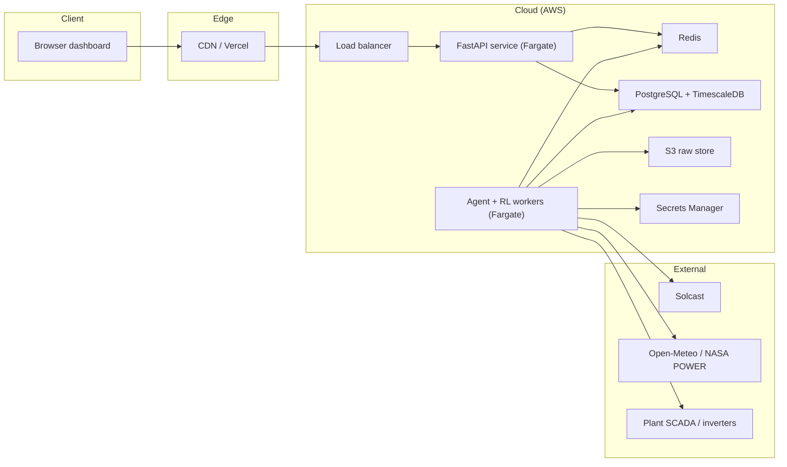

<svg xmlns="http://www.w3.org/2000/svg" viewBox="0 0 900 150" width="100%" height="150" role="img" aria-label="Solar Multi-Agent Platform banner">
  <defs>
    <linearGradient id="sky" x1="0" y1="0" x2="1" y2="1">
      <stop offset="0%" stop-color="#0b2545"/>
      <stop offset="55%" stop-color="#13315c"/>
      <stop offset="100%" stop-color="#1f6feb"/>
    </linearGradient>
    <linearGradient id="sun" x1="0" y1="0" x2="0" y2="1">
      <stop offset="0%" stop-color="#ffd166"/>
      <stop offset="100%" stop-color="#ff8c42"/>
    </linearGradient>
  </defs>
  <rect width="900" height="150" rx="14" fill="url(#sky)"/>
  <circle cx="760" cy="55" r="42" fill="url(#sun)"/>
  <g stroke="#ffd166" stroke-width="3" stroke-linecap="round" opacity="0.8">
    <line x1="760" y1="0" x2="760" y2="12"/>
    <line x1="822" y1="55" x2="836" y2="55"/>
    <line x1="684" y1="55" x2="698" y2="55"/>
    <line x1="804" y1="11" x2="814" y2="21"/>
    <line x1="706" y1="11" x2="716" y2="21"/>
  </g>
  <g fill="#0b2545" stroke="#5fd3f3" stroke-width="2">
    <rect x="40" y="92" width="70" height="44" rx="3" transform="skewX(-8)"/>
    <rect x="120" y="92" width="70" height="44" rx="3" transform="skewX(-8)"/>
    <rect x="200" y="92" width="70" height="44" rx="3" transform="skewX(-8)"/>
  </g>
  <text x="40" y="46" font-family="Segoe UI, Arial, sans-serif" font-size="32" font-weight="700" fill="#ffffff">Solar Multi-Agent Platform</text>
  <text x="42" y="74" font-family="Segoe UI, Arial, sans-serif" font-size="16" fill="#9fd0ff">Planning, Architecture, Reinforcement Learning and Cost Report</text>
</svg>

# Solar Energy Multi-Agent Platform

Planning, Architecture, Reward/Penalty Engine, Reinforcement Learning and Cost Report

Status: Phase 0 (software and simulation first, hardware later). Last updated: 2026-06-17. Currency: 1 USD = 95 INR.

---

## 0. How I interpreted your idea

You described the system in fast strokes, so this report is built on the interpretation below. If anything is wrong, tell me and I will adjust, because the numbers and architecture depend on it.

| Your words | Interpretation used in this report |
|---|---|
| "Solitaire / solute tech" platform | Solcast, a solar irradiance and weather forecast API. Primary data source. |
| 6 agents | Orchestrator, Forecast, Cloudinary, Logic/Calculation, Reward, API. |
| "Cloudinary agent" | Kept as named. Treated as the cloud-cover and media/asset handling agent. See note in section 12 if you meant Cloudinary the media CDN versus a cloud-cover data agent. |
| "reward, penalty, discount" | A settlement engine: plant owner sets a target of n kW, misses it, gets a penalty/fine; consumers get discounts. Optimized with Reinforcement Learning. |
| "RL reinforcement learning" | An RL policy that tunes penalty and discount levels plus dispatch to balance the grid and keep owners and consumers fair. |
| "level 1 level 2" | Three explicit levels: Level 1 Data, Level 2 Intelligence, Level 3 Experience. |
| "calculate energy consumed and produced" | A deterministic physics engine for PV production plus load profiles for consumption. |
| "rotate the APIs" | API key rotation, quota tracking and provider fail-over inside the API agent. |
| "integrate with power plants" | Plant/SCADA connectors. Simulated plants in Phase 0, real telemetry later. |
| "hardware plus software, software first" | Phase 0 to 2 are pure software and a digital twin. Hardware is Phase 3 and later. |

---

## 1. Executive summary

A three-level, agent-orchestrated platform that ingests solar and weather data, forecasts and computes energy production versus consumption for one or many sites, settles a reward and penalty scheme between plant owners and consumers, and continuously improves that scheme with Reinforcement Learning. Six cooperating agents run the loop: Orchestrator, Forecast, Cloudinary, Logic/Calculation, Reward and API.

Headline running cost (excludes salaries):

- Phase 0 simulation: about 70 USD per month, about 6,650 INR.
- Pilot (1 to 5 sites): about 265 to 895 USD per month, about 25,175 to 85,025 INR.
- Scale (50 plus sites): about 1,500 to 4,000 USD per month, about 142,500 to 380,000 INR.

---

## 2. The three levels (Level 1, Level 2, Level 3)

<svg xmlns="http://www.w3.org/2000/svg" viewBox="0 0 820 320" width="100%" height="320" role="img" aria-label="Three level stack">
  <style>
    .lbl{font-family:Segoe UI,Arial,sans-serif;font-weight:700;fill:#0b2545}
    .sub{font-family:Segoe UI,Arial,sans-serif;font-size:13px;fill:#33475b}
    .tag{font-family:Segoe UI,Arial,sans-serif;font-size:13px;font-weight:700;fill:#fff}
  </style>
  <rect x="60" y="20" width="700" height="80" rx="10" fill="#e7f0ff" stroke="#1f6feb" stroke-width="2"/>
  <rect x="60" y="20" width="150" height="80" rx="10" fill="#1f6feb"/>
  <text x="135" y="55" class="tag" text-anchor="middle">LEVEL 3</text>
  <text x="135" y="75" class="tag" text-anchor="middle" font-size="11">Experience</text>
  <text x="230" y="50" class="lbl" font-size="16">Experience and Integration</text>
  <text x="230" y="72" class="sub">Dashboard, REST/GraphQL API, plant connectors, alerts, multi-tenant auth</text>
  <rect x="60" y="120" width="700" height="80" rx="10" fill="#fff2df" stroke="#ff8c42" stroke-width="2"/>
  <rect x="60" y="120" width="150" height="80" rx="10" fill="#ff8c42"/>
  <text x="135" y="155" class="tag" text-anchor="middle">LEVEL 2</text>
  <text x="135" y="175" class="tag" text-anchor="middle" font-size="11">Intelligence</text>
  <text x="230" y="150" class="lbl" font-size="16">Intelligence: 6 agents plus RL</text>
  <text x="230" y="172" class="sub">Orchestrator, Forecast, Cloudinary, Logic, Reward (RL), API, energy engine</text>
  <rect x="60" y="220" width="700" height="80" rx="10" fill="#e6fbf0" stroke="#19a974" stroke-width="2"/>
  <rect x="60" y="220" width="150" height="80" rx="10" fill="#19a974"/>
  <text x="135" y="255" class="tag" text-anchor="middle">LEVEL 1</text>
  <text x="135" y="275" class="tag" text-anchor="middle" font-size="11">Data</text>
  <text x="230" y="250" class="lbl" font-size="16">Data Foundation</text>
  <text x="230" y="272" class="sub">Solcast plus fallbacks, ingestion workers, raw store, time-series DB, feature store</text>
</svg>

### Level 1: Data Foundation
- Sources: Solcast (primary), with free fallbacks Open-Meteo and NASA POWER, plus OpenWeatherMap.
- Ingestion workers pull on schedules (forecast every 30 minutes, actuals hourly).
- Storage: raw JSON to object storage; normalized series to a time-series DB (TimescaleDB or InfluxDB); engineered features to a feature table.
- Canonical record: site_id, ts, ghi, dni, dhi, temp, cloud_cover, wind, source, quality_flag.

### Level 2: Intelligence (6 agents plus RL)
- The six agents orchestrate ingest, forecast, compute, settle and serve.
- A deterministic energy engine (pvlib) does the physics. LLMs handle orchestration, explanation and config reasoning, not the numeric math, so results stay reproducible and cheap.
- The Reward agent runs the penalty and discount settlement and trains an RL policy on a digital twin.

### Level 3: Experience and Integration
- Web dashboard, REST/GraphQL API, plant connectors, alerting, multi-tenant auth.

---

## 3. System architecture (Mermaid)



---

## 4. The 6 agents

| # | Agent | Job | Uses an LLM? | Suggested model |
|---|---|---|---|---|
| 1 | Orchestrator | Plans each run, routes work, aggregates, retries, talks to the user. | Yes | Claude Sonnet or GPT-5 mini |
| 2 | Forecast | Produces production and irradiance forecasts from weather plus history. | Light, mostly ML/code | Small model plus pvlib/ML |
| 3 | Cloudinary | Handles cloud-cover interpretation and media/asset generation (charts, report images). | Light to medium | Small or mid model |
| 4 | Logic / Calculation | Runs the energy engine, reasons about production versus consumption gaps. | Medium | Mid-tier |
| 5 | Reward | Settles penalties for owners and discounts for consumers, trains and serves the RL policy. | Medium plus RL | Mid-tier plus RL (PPO) |
| 6 | API | Key rotation, quota tracking, provider fail-over, retry and cost guard. | Mostly code | Small model plus code |

Cost-control rule: agents 2 and 6 are about 90 percent deterministic code. Call an LLM only when a decision needs language or reasoning. Most agent cost blowups come from making every step an LLM call, so do not do that.

### Agent sequence for one cycle (Mermaid)



### Workflow state machine with QA loop (Mermaid)



---

## 5. Reward, penalty and discount engine

Business logic in plain terms:

- A plant owner commits a target T in kW for a settlement window.
- The platform measures actual production P over that window.
- If P is greater than or equal to T, the owner earns a credit or bonus.
- If P is less than T, the owner pays a penalty proportional to the shortfall.
- Consumers earn a discount for consuming during surplus or for demand-response participation.

Formulas:

```
shortfall      = max(0, T - P)                       # kW
penalty_amount = penalty_rate * shortfall * hours    # currency
bonus_amount   = bonus_rate   * max(0, P - T) * hours
discount_amount= discount_rate * shifted_load * hours
net_owner      = bonus_amount - penalty_amount
```

The penalty_rate, bonus_rate and discount_rate are not fixed. They are set by the RL policy so the grid stays balanced and the scheme stays fair and attractive.

### Reward and penalty decision flow (Mermaid)



---

## 6. Reinforcement Learning design

The Reward agent learns the best rate and dispatch policy on a digital twin built in Phase 0, then serves the trained policy in production.

- Environment: digital twin of plant, grid and consumers (Phase 0 simulation).
- State: weather and production forecast, current production P, owner target T, consumption, battery state of charge, time of day, current tariff.
- Action: set penalty_rate, bonus_rate, discount_rate, plus dispatch or curtailment level.
- Reward signal: positive for meeting targets, grid balance and consumer satisfaction; negative for penalties incurred, deficits and wasted curtailment.
- Algorithm: PPO as the default (stable, robust). DQN if actions are discretized. Tools: Stable-Baselines3 or Ray RLlib, Gymnasium environment.

```
reward_t = w1 * target_met
         + w2 * grid_balance
         + w3 * consumer_satisfaction
         - w4 * penalties_incurred
         - w5 * deficit
         - w6 * curtailment_waste
```

### RL loop (Mermaid)



---

## 7. Energy calculation methodology

Keep this deterministic and physics-based with pvlib. LLMs only explain the results.

Production per timestep:

```
DC_power  = (G_POA / 1000) * P_rated * (1 + gamma * (T_cell - 25)) * soiling
AC_power  = DC_power * inverter_efficiency
Energy_kWh= sum(AC_power * delta_t)
```

- G_POA: plane-of-array irradiance from GHI, DNI, DHI plus tilt and orientation (pvlib transposition).
- P_rated: installed kWp. gamma: temperature coefficient about -0.35 percent per degree C. inverter_efficiency about 0.96.
- Cloud cover from the Cloudinary agent modulates irradiance and forecast confidence.

Consumption: synthetic load profiles in Phase 0 (residential, commercial, industrial); real meter or building-load data later.

Derived outputs: surplus or deficit per interval, self-consumption percent, grid import and export, daily and monthly forecast, and anomaly flags when actual is far below expected.

---

## 8. Data model (Mermaid ER diagram)



---

## 9. Tech stack

| Concern | Recommendation | Why |
|---|---|---|
| Language | Python 3.12 | Best ecosystem for LLM plus PV math (pvlib) plus RL. |
| Agent framework | LangGraph plus LangChain tools | Explicit graph, loops and state match the orchestrator and QA pattern. |
| RL | Stable-Baselines3 or Ray RLlib, Gymnasium | Standard, well supported PPO/DQN. |
| Energy / PV math | pvlib, NumPy, Pandas | Validated PV models, keeps math out of the LLM. |
| API layer | FastAPI | Async, typed, auto OpenAPI docs. |
| Time-series DB | TimescaleDB or InfluxDB | Solar data is time-series heavy. |
| Relational / metadata | PostgreSQL | Sites, users, configs, billing. |
| Object / raw store | S3 or MinIO | Cheap raw payload archive. |
| Cache / queue | Redis | Rate-limit counters, key rotation state, job queue. |
| Scheduling | Celery, APScheduler or Temporal | Periodic ingestion and workflow runs. |
| Dashboard | Next.js, React, Recharts or ECharts | Time-series charts, multi-site views. |
| Auth | Auth0, Clerk or Keycloak | Multi-tenant, do not roll your own. |
| Secrets / keys | AWS Secrets Manager or Vault | Required for safe API key rotation. |
| Observability | LangSmith plus Grafana and Prometheus | Debug agent loops plus system metrics. |
| Deploy | Docker plus AWS ECS/Fargate or Kubernetes | Scale workers independently. |
| IaC and CI/CD | Terraform plus GitHub Actions | Reproducible infra, standard pipelines. |

Hardware phase later: ESP32 or Raspberry Pi edge nodes, Modbus or MQTT for inverters and sensors, MQTT broker (EMQX) feeding Level 1.

---

## 10. Cost estimation (USD and INR at 95 INR per USD)

Model prices are per 1,000,000 tokens (input / output), USD, from current public pricing pages (mid-2026, verify before committing).

| Model | Input USD | Output USD | Use for |
|---|---|---|---|
| Claude Opus (flagship) | 5.00 | 25.00 | Hard reasoning only. |
| Claude Sonnet | 3.00 | 15.00 | Orchestrator, Logic, Reward. |
| Claude Haiku | 1.00 | 5.00 | Forecast and Cloudinary light reasoning. |
| GPT-5 mini | 0.25 | 2.00 | Cheap orchestration and classification. |
| GPT-5 nano | 0.05 | 0.40 | Trivial routing and extraction. |
| Gemini Flash (2.x) | 0.10 | 0.40 | High volume cheap calls, large context. |
| DeepSeek V4 | 0.44 | low | Budget reasoning alternative. |

### 10.1 LLM usage at pilot scale

Assume 5 sites, hourly cycle (24 per day), about 6 LLM calls per cycle, about 2,000 input and 500 output tokens per call, blended about 2 USD input and 8 USD output per 1,000,000 tokens.

```
Calls/month  = 5 * 24 * 30 * 6  = 21,600 calls
Input tokens = 21,600 * 2,000   = 43.2M  -> about 86 USD
Output tokens= 21,600 * 500     = 10.8M  -> about 86 USD
LLM subtotal                    = about 170 USD  (about 16,150 INR)
With caching and cheaper models = about 70 USD   (about 6,650 INR)
```

### 10.2 Solar data (Solcast)

Solcast pricing is quote based and metered (a fixed monthly fee per about 10,000 API calls, with a small step per extra 10,000). There is no flat public price, so request a quote. A free trial exists. Free fallbacks (Open-Meteo, NASA POWER) cut this cost.

Budget estimate: about 100 to 400 USD per month, about 9,500 to 38,000 INR.

### 10.3 Infrastructure (cloud, pilot)

| Item | USD per month | INR per month |
|---|---|---|
| Compute (Fargate small plus workers) | 40 to 120 | 3,800 to 11,400 |
| Postgres plus TimescaleDB (managed small) | 30 to 80 | 2,850 to 7,600 |
| Redis (managed small) | 15 to 40 | 1,425 to 3,800 |
| Object storage (S3, low volume) | 5 to 15 | 475 to 1,425 |
| Dashboard hosting (Vercel/Amplify) | 0 to 20 | 0 to 1,900 |
| Observability (starter tiers) | 0 to 50 | 0 to 4,750 |
| Infra subtotal | 95 to 325 | 9,025 to 30,875 |

### 10.4 Total running cost (excludes salaries)

| Tier | LLM USD | Data USD | Infra USD | Total USD | Total INR |
|---|---|---|---|---|---|
| Dev / Sim (Phase 0) | about 20 | 0 (free APIs) | about 50 | about 70 | about 6,650 |
| Pilot (Phase 1) | 70 to 170 | 100 to 400 | 95 to 325 | 265 to 895 | 25,175 to 85,025 |
| Scale (Phase 2, 50 plus sites) | 500 to 1,500 | quote | 500 to 1,500 | 1,500 to 4,000 | 142,500 to 380,000 |

One time hardware (Phase 3, per site, indicative): edge controller plus sensors 50 to 200 USD (4,750 to 19,000 INR); inverter and metering telemetry varies widely. Not included above.

### 10.5 Cost split at pilot (Mermaid pie)



### 10.6 Pilot cost range (inline SVG bar chart)

<svg xmlns="http://www.w3.org/2000/svg" viewBox="0 0 720 280" width="100%" height="280" role="img" aria-label="Pilot cost range bar chart">
  <style>
    .ax{stroke:#90a4b8;stroke-width:1}
    .t{font-family:Segoe UI,Arial,sans-serif;font-size:12px;fill:#33475b}
    .v{font-family:Segoe UI,Arial,sans-serif;font-size:12px;font-weight:700;fill:#0b2545}
    .cap{font-family:Segoe UI,Arial,sans-serif;font-size:13px;font-weight:700;fill:#0b2545}
  </style>
  <text x="20" y="22" class="cap">Pilot monthly cost (USD): low vs high</text>
  <line x1="60" y1="40" x2="60" y2="220" class="ax"/>
  <line x1="60" y1="220" x2="700" y2="220" class="ax"/>
  <!-- LLM low 70 high 170 -->
  <rect x="110" y="196" width="50" height="24" fill="#1f6feb"/>
  <rect x="170" y="160" width="50" height="60" fill="#9fd0ff"/>
  <text x="135" y="240" class="t" text-anchor="middle">LLM</text>
  <text x="135" y="190" class="v" text-anchor="middle">70</text>
  <text x="195" y="154" class="v" text-anchor="middle">170</text>
  <!-- Data low 100 high 400 -->
  <rect x="300" y="186" width="50" height="34" fill="#ff8c42"/>
  <rect x="360" y="84" width="50" height="136" fill="#ffd166"/>
  <text x="355" y="240" class="t" text-anchor="middle">Data</text>
  <text x="325" y="180" class="v" text-anchor="middle">100</text>
  <text x="385" y="78" class="v" text-anchor="middle">400</text>
  <!-- Infra low 95 high 325 -->
  <rect x="490" y="188" width="50" height="32" fill="#19a974"/>
  <rect x="550" y="110" width="50" height="110" fill="#8be0bb"/>
  <text x="545" y="240" class="t" text-anchor="middle">Infra</text>
  <text x="515" y="182" class="v" text-anchor="middle">95</text>
  <text x="575" y="104" class="v" text-anchor="middle">325</text>
  <text x="360" y="268" class="t" text-anchor="middle">Dark bar = low estimate, light bar = high estimate. INR = USD x 95.</text>
</svg>

---

## 11. Roadmap (Mermaid Gantt)



| Phase | Goal | Estimate | Key deliverable |
|---|---|---|---|
| 0 Simulation | Prove agent loop, energy math and an RL baseline on historical data | 4 to 6 weeks | LangGraph pipeline, pvlib engine, RL twin |
| 1 Pilot | Live Solcast plus fallbacks, 1 to 5 sites, dashboard and API | 6 to 10 weeks | FastAPI plus Next.js dashboard |
| 2 Scale | Multi-tenant, forecasting, alerting, RL in production | 8 to 12 weeks | Productionized and monitored |
| 3 Hardware | Edge sensors and inverter telemetry, closed loop | TBD | Digital twin synced to a real plant |

---

## 12. Deployment view (Mermaid)



---

## 13. Key risks and mitigations

| Risk | Mitigation |
|---|---|
| LLM cost blowup (every step an LLM call) | Make Forecast and API agents mostly code, cache, use cheaper models, batch. |
| Non-reproducible numbers (LLM doing math) | Physics in pvlib, LLM only explains. |
| RL unstable or unfair rates | Train on a twin first, clip rate ranges, keep a human-set floor and ceiling on penalties and discounts. |
| Solcast cost and quota | Free fallbacks, caching, request a quote early, rate budget in the API agent. |
| Agent or QA infinite loops | Hard max-iteration caps in the Review to Compute loop. |
| API key leakage | Secrets Manager or Vault, never in code, rotation via the API agent. |
| Plant integration security | Connectors and public endpoints need auth and least privilege from day one. |
| Penalty disputes | Store immutable settlement records, expose an audit trail to owners and consumers. |

Security note: any plant or SCADA connector or public API endpoint must have authentication and access control from day one. Do not expose ingestion or control endpoints unauthenticated.

---

## 14. Open questions

1. Solitaire equals Solcast? If it is a different platform, name it and I will re-cost.
2. Cloudinary agent: cloud-cover and chart/asset generation as assumed, or literally Cloudinary the media CDN? They are different.
3. Penalty and discount currency and legal basis: who enforces fines, and under what contract or tariff?
4. Reward target T: per day, per hour, or per settlement window? What is the floor and ceiling on penalty rates?
5. Scale target: how many sites in the pilot and at full scale?
6. Integrate with power plants: read-only telemetry or actual control? Control raises the safety and security bar a lot.
7. Hosting preference: AWS, GCP, Azure or self-hosted? This affects exact infra cost.
8. Region and market: affects data sources, grid tariffs and consumption modeling.

---

## 15. Immediate next steps

1. Confirm the assumptions in sections 0 and 14.
2. Start a Solcast free trial and wire up Open-Meteo and NASA POWER as free fallbacks.
3. Scaffold the repo: FastAPI plus LangGraph plus pvlib plus TimescaleDB with the 6 agents stubbed.
4. Build the deterministic energy engine first (testable without LLMs).
5. Build the digital twin and an RL baseline (PPO) for the Reward agent.
6. Run Phase 0 on historical data for one simulated site.

I can scaffold the Phase 0 codebase (repo structure, energy engine, agent stubs, RL twin, sample Solcast and Open-Meteo client) whenever you are ready.
