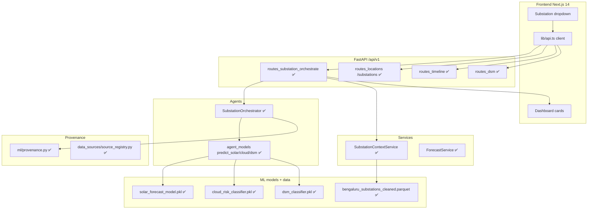

# SuryaGrid AI — Execution Plan: Substation-Driven Forecasting & DSM Workflow

**Document type:** Technical execution plan (planning document, not a design essay)
**Scope:** Next development phase — make substation selection drive the full forecasting + DSM workflow
**Baseline commit:** `5bed3cd` (substation-driven workflow foundation) on `main` (pushed to `dbit`, `origin`)
**Prepared:** 2026-07-07 · **Status legend:** ✅ IMPLEMENTED · 🟡 PARTIAL · ⛔ BLOCKED (needs official source) · ⬜ PLANNED

> **Accuracy contract.** Every "IMPLEMENTED" row below is backed by a file in the repository, a
> model card, a test, or command output verified this session. Items needing data the repo does
> not contain are marked ⛔ with the required official source. Nothing is fabricated.

---

## 1. Executive Summary

**Current verified state.** SuryaGrid AI is an architecturally complete, partially data-complete
prototype. The FastAPI backend exposes **61 `/api/v1` operations** and passes **118 tests**
(`ruff check` clean). The Next.js 14 frontend builds (16 static routes). Real-data ML models are
trained and carry cards: solar irradiance R²=0.956, cloud-risk F1=0.67/AUC=0.90, DSM-breach
F1=0.79 (Open-Meteo Bengaluru), plus Kaggle Bengaluru irradiance R²=0.920 and cloud F1=0.847.
344 substations are ingested from OpenStreetMap (**capacity 0%, voltage 41%** — capacity never
fabricated). As of commit `5bed3cd`, the **substation-driven workflow foundation is implemented**:
`SubstationContext`, a context service over the real parquet, an orchestrator agent, five new
endpoints, honest DSM blocking, `agent_trace`/`calculation_trace`, and a frontend
`SubstationWorkflowPanel` wired into the Locations and DSM pages, covered by 15 tests.

**What this phase implements.** The remaining gap is **end-to-end, dashboard-wide substation
context**. Today the main dashboard still runs off a hardcoded `LOCATIONS` preset list; the
substation dropdown drives only the combined panel on two pages. This phase makes the selected
`substation_id` the single active context for **every** dashboard card (weather, solar, cloud,
generation timeline, DSM, source/limitation, agent-trace), adds a shared/persisted selection,
reconciles the DB-backed `/substations` list with the parquet-backed `/substations/catalog`, and
hardens missing-data + source-trace surfacing across the UI.

**Why substation-driven context is needed.** A dropdown that only changes display text is
cosmetic. Grid behaviour (irradiance at the substation's coordinates, cloud risk, generation,
deviation risk) is location-specific. The selection must change the **actual agent input
context**, and every number must remain traceable to a source with missing fields explicit.

**Expected final outcome.** Selecting a substation refreshes all dashboard panels with values
computed for that substation's coordinates and provenance; DSM output lists enabled vs blocked
calculations honestly (no rupee/capacity/load fabrication); responses always carry `agent_trace`
+ `calculation_trace`; tests and the frontend build pass.

---

## 2. Current Verified Baseline

Derived from the repository, model cards, `docs/report/report_evidence_matrix.md`,
`docs/substation_data_quality_report.md`, `docs/REAL_DATA_PHASE1_7_BENGALURU_ML.md`,
`docs/KAGGLE_TRAINING_RESULTS.md`, and the `5bed3cd` commit verification.

| Area | Current Verified Status | Evidence | Limitation | Next Action |
|------|-------------------------|----------|------------|-------------|
| Backend API | ✅ 61 `/api/v1` operations, 118 tests pass | route introspection; `pytest -q` "118 passed" | — | Keep parity as UI wires in |
| Substation workflow (backend) | ✅ context + orchestrator + 5 endpoints (`5bed3cd`) | `schemas/substation_context.py`, `services/substation_context_service.py`, `agents/substation_orchestrator.py`, `api/routes_substation_orchestrate.py` | Combined only; per-card UI pending | Wire all dashboard cards |
| Agents | ✅ 16 platform agents + substation orchestrator (7 steps) | `backend/app/agents/*`; `agent_trace` in orchestrate response | Weather live-fetch degrades to clear-sky offline | Keep clear-sky fallback labelled |
| ML models | ✅ 3 Open-Meteo + 2 Kaggle prod; 🟡 PV/load non-prod; ⬜ RL skipped | model cards in `backend/models/metadata/*` | PV/load are REAL_INDIA (domain shift); RL untrained | Use prod models only in UI |
| ML datasets | ✅ present (parquet + manifests) | `backend/data/ml/*.parquet`, `dataset_build_manifest.json` | large parquets gitignored (reproducible) | — |
| Data sources | 🟡 Open-Meteo + OSM live; NASA POWER cross-check only; Kaggle used | `data_sources/`, `source_registry.py`, `provenance.py` | NASA live provider pending; SLDC/CEA not wired | Prep official-source adapters |
| Substation data | ✅ 344 OSM rows committed; capacity 0%, voltage 41% | `bengaluru_substations_cleaned.parquet`; `substation_data_quality_report.md` | capacity/district null; no load telemetry | ⛔ needs KPTCL/BESCOM |
| DSM | 🟡 framework only; ML breach classifier; **no rupee values** | `dsm/`, `agent_models.predict_dsm`, DSM forecast `emits_rupee_values=false` | slab rupee rates PENDING | ⛔ needs KERC/CERC tariff order |
| Frontend | ✅ builds (16 routes); panel on Locations+DSM | `npm run build` pass; `SubstationWorkflowPanel.tsx` | dashboard uses hardcoded `LOCATIONS`; cards not substation-driven | Wire dashboard + shared state |
| Deployment | 🟡 single-instance docker-compose+nginx live (HTTP) | `report_evidence_matrix.md` A1–A6 | DB `record_counts=0`; ECS code-only; HTTP-only | Verify `/substations` vs catalog on host |
| Lint | ✅ `ruff check app tests` clean; 🟡 `ruff format --check` 5 pre-existing files | verified this session | 5 team Kaggle files unformatted (pre-existing) | Optional format-only follow-up |

**Not present / must not be claimed:** substation capacity (MVA), metered Karnataka/feeder load,
official parsed KERC/CERC rupee tariff rates, local Bengaluru PV generation truth, deployed AWS ECS
stack. All tracked ⛔.

---

## 3. Problem Statement

Substations exist in the system (344 real OSM rows via `/substations/catalog`), and the backing
workflow endpoints exist (`5bed3cd`). **The gap:** the selected substation is not yet the active
context across the whole product surface.

- The **main dashboard** (`frontend/app/dashboard/page.tsx`) drives its cards from a hardcoded
  `LOCATIONS` preset array and `predictSite("primary-site", …)` — **not** from a substation.
- The substation dropdown currently lives only inside `SubstationWorkflowPanel` on the **Locations**
  and **DSM** pages; it does not update the separate weather / solar / cloud / timeline / DSM /
  source / agent-trace cards, and there is no shared selection across pages.
- The DB-backed `GET /substations` list and the parquet-backed `GET /substations/catalog` can
  disagree (hosted DB `record_counts=0` → empty list, while catalog returns 344).

**Requirement:** the dropdown must change the **actual agent input context** — the selected
`substation_id` must flow to the backend, become a `SubstationContext`, reach every agent + the
DSM engine + the orchestrator, and refresh every relevant frontend panel — with source trace,
agent trace, and explicit missing/blocked handling.

---

## 4. Target Architecture

### 4.1 Selection → context → agents → dashboard (request flow)

```mermaid
flowchart LR
  A[Frontend Substation Dropdown] -->|selected_substation_id| B[GET /api/v1/substations/{id}]
  B --> C[SubstationContext]
  C --> D[POST /api/v1/orchestrate/substation]
  D --> E[Orchestrator Agent]
  E --> W[Weather Agent<br/>Open-Meteo @ lat/lon]
  E --> S[Solar Forecast Agent<br/>solar_forecast_model.pkl]
  E --> K[Cloud Risk Agent<br/>cloud_risk_classifier.pkl]
  E --> G[Generation Timeline Service]
  E --> X[DSM Engine<br/>predict_dsm + honest blocking]
  W --> R[API Response<br/>+ agent_trace + calculation_trace]
  S --> R
  K --> R
  G --> R
  X --> R
  R --> UI[Frontend Dashboard Panels]
```

### 4.2 Backend architecture (implemented vs planned)



---

## 5. SubstationContext Specification

Canonical object (`backend/app/schemas/substation_context.py`, ✅ implemented `5bed3cd`). Built by
`SubstationContextService.get_context()` which coerces `None`/`NaN`/`"nan"/"none"/"null"/""` → `null`.

```python
class SubstationContext(BaseModel):
    # identity & geography (always present in OSM)
    substation_id: str
    name: str | None
    latitude: float
    longitude: float
    # may be missing in the real source (kept null, never fabricated)
    operator: str | None            # 147/344 present
    voltage_kv: float | None        # 141/344 present
    capacity_mva: float | None      # 0/344 present -> ALWAYS null
    district: str | None            # 0/344 present -> ALWAYS null
    state: str | None
    # provenance carried from the dataset
    source: str | None
    source_url: str | None
    reliability_score: float | None
    missing_fields: list[str]
    data_geography: str | None
    ingestion_time: str | None
    # derived workflow context
    display_label: str
    distance_from_site_km: float | None
    nearest_weather_location: dict | None
    weather_source: str | None      # "Open-Meteo @ (lat,lon) [REAL_COORDINATE_BASED]"
    solar_source: str | None        # "solar_forecast_model.pkl [REAL_BENGALURU]"
    tariff_region: str | None       # "Karnataka (KERC)"
    # honest per-field status flags
    source_status: str              # REAL_BENGALURU | REAL_KARNATAKA
    capacity_status: str            # NOT_AVAILABLE (capacity null)
    voltage_status: str             # source_status | NOT_AVAILABLE
    load_data_status: str           # NOT_AVAILABLE
    tariff_status: str              # NEEDS_OFFICIAL_SOURCE
    limitation_notes: list[str]
```

**Honesty rules (enforced):** missing `capacity_mva` stays `null` → `capacity_status=NOT_AVAILABLE`;
missing `voltage_kv` stays `null` → `voltage_status=NOT_AVAILABLE`; load is `NOT_AVAILABLE`; tariff is
`NEEDS_OFFICIAL_SOURCE`; no value is fabricated.

---

## 6. Detailed Agent Workflow

Implemented in `SubstationOrchestrator.run()` (✅ `5bed3cd`). Every step appends to `agent_trace`;
every number records formula + provenance in `calculation_trace`.

| Step | Agent / Service | Input | Processing | Output | Source trace | Missing-data behavior |
|------|-----------------|-------|------------|--------|--------------|-----------------------|
| 1 | Frontend selection | user click | dropdown → `substation_id` | request w/ `substation_id` | — | disabled until catalog loads |
| 2 | SubstationContextService | `substation_id` | load parquet row, coerce NaN/None, compute statuses | `SubstationContext` | `REAL_BENGALURU`/`REAL_KARNATAKA` | unknown id → 404; missing fields → null + status |
| 3 | Weather Agent | context lat/lon | Open-Meteo @ coords; clear-sky fallback | hourly weather + GHI | `REAL_COORDINATE_BASED` | network fail → pvlib clear-sky (labelled), never synthetic |
| 4 | Solar Forecast Agent | context + weather + model | `predict_solar()` per hour | irradiance forecast (+ est. PV if capacity given) | `REAL_BENGALURU` | model missing → `NOT_AVAILABLE`, value null |
| 5 | Cloud Risk Agent | radiation/weather features | `predict_cloud()` per hour | P(kt<0.5) drop risk | `REAL_BENGALURU` | model missing → `NOT_AVAILABLE` |
| 6 | Generation Timeline Service | weather + solar + cloud + substation | assemble hourly rows | timestamped timeline (each row carries `substation_id`) | `ESTIMATED_FROM_IRRADIANCE` | no `site_capacity_mw` → MW null (irradiance only) |
| 7 | DSM Engine | context + timeline + tariff/load status | `predict_dsm()` + honest gating | recommendation + blocked calcs | `NEEDS_OFFICIAL_SOURCE` | capacity/load/tariff missing → block + reason |
| 8 | Orchestrator Agent | all outputs | assemble + provenance | final response w/ `agent_trace`+`calculation_trace` | `ESTIMATED_FROM_REAL` | degraded steps flagged in trace |
| 9 | Frontend Rendering | orchestrator response | update panels | refreshed dashboard | data_sources + limitations | show warnings for missing/blocked |

---

## 7. API Execution Plan

Base `/api/v1`. Envelope `{success, message, data, timestamp}`.

| Method | Path | Status | Request | Response (data) | Agents/Services | Frontend consumer | Acceptance |
|--------|------|--------|---------|-----------------|-----------------|-------------------|-----------|
| GET | `/substations` | ✅ (DB list) | `?limit` | DB substations (may be empty) | `repository.list_substations` | Locations table | list or explicit empty state |
| GET | `/substations/catalog` | ✅ `5bed3cd` | `?limit` | 344 `{id, display_label, coords, voltage, reliability}` sorted | `SubstationContextService.list_catalog` | Dropdown | dropdown loads 344 |
| GET | `/substations/{substation_id}` | ✅ `5bed3cd` | path id | full `SubstationContext` (404 if unknown) | `SubstationContextService.get_context` | Detail card | context returned; missing null |
| POST | `/orchestrate/substation` | ✅ `5bed3cd` | `{substation_id, site_capacity_mw?, scheduled_generation_mw?, forecast_horizon_hours=6, use_live_weather=true}` | substation + workflow trace + timeline + DSM + sources + limitations | Orchestrator + all agents | Dashboard refresh | 7-step trace; `is_synthetic=false` |
| POST | `/dsm/forecast` | ✅ `5bed3cd` | same body | `dsm_forecast` (blocked calcs, `emits_rupee_values=false`) + trace | Orchestrator DSM step | DSM panel | no rupees; capacity blocked |
| GET | `/generation/timeline` | ✅ `5bed3cd` | `?substation_id&site_capacity_mw&forecast_horizon_hours&allow_estimated&use_live_weather` | timeline + summary + weather + trace | Orchestrator (timeline) | Timeline component | rows carry `substation_id` |
| GET | `/substations/catalog` ↔ `/substations` reconciliation | ⬜ PLANNED | — | consistent source of truth | seed DB from parquet **or** point UI to catalog | Locations + dropdown | one authoritative list |

**Remaining API work (⬜):** reconcile the DB list vs parquet catalog (recommended: point the
dropdown/detail at `catalog`/`{id}`, and optionally seed the `substations` table from the parquet on
startup so `/substations` and `/substations/catalog` agree). No new endpoints are strictly required.

---

## 8. Frontend Execution Plan

Verified components: `ModelProvenancePanel`, `OfflineBanner`, `SubstationWorkflowPanel` (new),
`cards/{MetricCard,PenaltyStatusCard}`, `charts/{DeviationBar,MiniTimeline}`, `svg/{SolarPanel3D,
RiskGauge3D,EnergyFlow3D}`. Dashboard currently uses a hardcoded `LOCATIONS` array.

| Component / page | Current behavior | Required change | Backend endpoint | UI output | Loading/error | Acceptance |
|------------------|------------------|-----------------|------------------|-----------|---------------|-----------|
| `lib/api.ts` | ✅ has catalog/context/orchestrate/dsm/timeline client fns (`5bed3cd`) | reuse; add shared fetch on selection | orchestrate/substation | — | throw on fail (no fake) | fns typed, no mock in real mode |
| Substation dropdown | in `SubstationWorkflowPanel` on 2 pages | promote to a shared selector (context/store or query param) | `/substations/catalog` | dropdown of 344 | spinner while loading | selection persists across pages |
| `app/dashboard/page.tsx` | hardcoded `LOCATIONS` + `predictSite` | add substation selector → drive cards from orchestrate | `/orchestrate/substation` | all cards refresh | loading/err states | selecting refreshes dashboard |
| Substation detail card | ✅ in panel | surface on dashboard | `/substations/{id}` | id, coords, voltage/kV or "unknown", status chips, missing_fields | — | missing fields explicit |
| Weather card | not substation-driven | bind to orchestrate `weather` | `/orchestrate/substation` | mode + source + per-hour | — | shows `REAL_COORDINATE_BASED` |
| Solar forecast card | preset-driven | bind to orchestrate timeline GHI | `/orchestrate/substation` | GHI series | — | irradiance for selected coords |
| Cloud risk card | preset-driven | bind to `cloud_drop_risk` | `/orchestrate/substation` | risk % | — | per-hour risk shown |
| Generation timeline (`MiniTimeline`) | `getTimeline("primary-site")` | bind to `/generation/timeline` | `/generation/timeline` | rows w/ `substation_id`, est MW | — | timeline updates on selection |
| DSM panel | `SubstationWorkflowPanel` (dsm page) | dedicated card on dashboard | `/dsm/forecast` | deviation, band, blocked calcs, "NO RUPEE" | — | blocked calcs + no rupees |
| Source/limitation panel | in panel | dashboard-wide panel | orchestrate `data_sources`+`limitations` | source list + limitations | — | provenance always visible |
| Agent workflow trace panel | in panel | dashboard-wide panel | orchestrate `workflow.agent_trace` | 7-step trace + status chips | — | trace rendered |

**Guardrail:** no redesign; reuse `glass-card`/`input-field`/`btn-primary`. Never render mock data
when the backend is reachable; keep the `OfflineBanner` behavior.

---

## 9. DSM Engine Data Usage Plan

DSM step (`SubstationOrchestrator._build_dsm_forecast` + `agent_models.predict_dsm`, ✅ `5bed3cd`).

**DSM input:** `selected_substation` (context), `generation_timeline`, `solar_forecast`,
`cloud_risk`, `load_data_status`, `tariff_source_status`, `capacity_status`, `voltage_status`,
`consumer_profile` (⬜ optional future), `source_trace`.

**DSM output:** `recommendation` / `framework_recommendation`, `action`, `risk`/`deviation_band`,
`confidence` (from breach model), `fields used` (`context_inputs_used`), `fields missing`,
`calculations enabled`, `calculations blocked` (`blocked_calculations`), `reason`, `limitation_notes`.

**Blocked-calculation rules (enforced):**

| Condition | Blocked calculation | Status flag |
|-----------|---------------------|-------------|
| `capacity_mva` missing (always, in OSM) | `substation_loading_percent` | `capacity_status=NOT_AVAILABLE` |
| load data missing | `load_following_optimisation` | `load_data_status=NOT_AVAILABLE` |
| official tariff missing | `dsm_rupee_charge` (settlement/savings) | `tariff_status=NEEDS_OFFICIAL_SOURCE`, `emits_rupee_values=false` |
| PV generation unavailable | mark `generation_type=ESTIMATED_FROM_IRRADIANCE`, `actual_generation_available=false` | — |
| `voltage_kv` missing | `voltage_band_optimisation` | `voltage_status=NOT_AVAILABLE` |

---

## 10. Generation Timeline Data Usage Plan

Timeline rows (✅ `5bed3cd`; extend fields marked ⬜):

| Field | Status | Notes |
|-------|--------|-------|
| `timestamp` | ✅ | hourly, local |
| `substation_id` | ✅ | every row carries it |
| `substation_name` / `substation_label` | ✅ (`substation_label`) | ⬜ add explicit `substation_name` if desired |
| weather features | 🟡 | `clearsky_ghi_wm2`, `observed_ghi_wm2`; ⬜ expose temp/cloud per row |
| `irradiance_forecast` (`forecast_ghi_wm2`) | ✅ | model GHI |
| `estimated_generation_mw` (if capacity) | ✅ | `capacity*(GHI/1000)*PR(0.80)`; null without capacity |
| `cloud_risk_level` (`cloud_drop_risk`) | ✅ | probability |
| `confidence_components` | ⬜ PLANNED | expose confidence breakdown per row |
| `data_sources` | 🟡 | at response level; ⬜ optional per-row |
| `limitations` | ✅ | response level |

Rule (enforced): no actual generation exists → `generation_type=ESTIMATED_FROM_IRRADIANCE`,
`actual_generation_available=false`.

---

## 11. Calculation Trace and Agent Trace Design

Both present in the orchestrate response (✅ `5bed3cd`).

**`agent_trace[]`** (per step): `agent`, `status` (ok/degraded/blocked/not_available),
`action` (≈ inputs/outputs summary), `source_label`, `detail`. ⬜ optional: split explicit
`inputs_used` / `outputs_produced` / `errors` arrays.

**`calculation_trace{}`** current keys: `clearsky_ghi_wm2`, `forecast_ghi_wm2`, `cloud_drop_risk`,
`estimated_generation_mw`, `scheduled_ghi_estimate_wm2`, `deviation_percent` — each with
`formula`, `inputs`, `source_label`, and `model_file` where relevant. ⬜ planned additions to fully
match the requested schema:

```json
{
  "selected_substation_fields_used": ["substation_id","latitude","longitude","voltage_kv"],
  "selected_substation_fields_missing": ["capacity_mva","district"],
  "weather_features_used": ["cloud_cover_percent","temperature_c","..."],
  "solar_features_used": ["clearsky_ghi_wm2","hour","..."],
  "grid_features_used": [],
  "tariff_features_used": [],
  "load_features_used": [],
  "model_files_used": ["solar_forecast_model.pkl","cloud_risk_classifier.pkl","dsm_classifier.pkl"],
  "formulas_or_rules_used": ["Ineichen clearsky","PV proxy PR=0.80","deviation %"],
  "calculations_skipped": ["substation_loading_percent","dsm_rupee_charge"],
  "skip_reasons": {"substation_loading_percent":"capacity_mva NOT_AVAILABLE"}
}
```

---

## 12. Implementation Timeline

Durations are working-day estimates. Because the backend foundation shipped in `5bed3cd`, the
critical path is frontend wiring + trace enrichment + tests.

| Phase | Focus | Status | Duration | Key tasks | Files likely affected | Dependencies | Output artifact | Acceptance | Risk |
|-------|-------|--------|----------|-----------|-----------------------|--------------|-----------------|-----------|------|
| A | Repo audit & endpoint mapping | ✅ done | 0.5d | this document | `docs/` | — | this plan | plan reviewed | low |
| B | SubstationContext schema/service | ✅ `5bed3cd` | — | context + coercion | `schemas/`, `services/` | A | schema+service | context returned | low |
| C | Backend API integration | ✅ `5bed3cd` | — | 5 endpoints | `api/routes_substation_orchestrate.py`, `main.py` | B | endpoints | 200s + 404 | low |
| D | Agent integration | ✅ `5bed3cd` | — | weather/solar/cloud in orchestrator | `agents/substation_orchestrator.py` | C | orchestrator | 7-step trace | med (weather net) |
| E | DSM engine integration | ✅ `5bed3cd` | — | honest blocking | `agents/substation_orchestrator.py` | D | DSM forecast | no rupees | ⛔ tariff |
| F | Generation timeline | ✅ `5bed3cd` | — | rows w/ substation_id | orchestrator | D | timeline | rows carry id | low |
| G | **Frontend dashboard wiring** | ⬜ PLANNED | 2–3d | shared selection, drive all cards | `app/dashboard/page.tsx`, `components/*`, `lib/api.ts` | C–F | wired dashboard | selection refreshes all | med (UI churn) |
| H | Source-trace & missing-data UI | ⬜ PLANNED | 1–2d | surface trace + limitations per card; enrich `calculation_trace` | `components/*`, orchestrator (fields) | G | trace panels | missing/blocked explicit | low |
| I | Tests & validation | 🟡 15 backend done | 1–2d | frontend build + expand backend/UI tests | `backend/tests/*`, frontend | G,H | green tests | pytest + build pass | low |
| J | Docs & deployment verify | 🟡 docs updated | 1d | verify hosted `/substations` vs catalog | `docs/`, host check | I | deploy note | host consistent | med (empty DB) |

### Gantt-style summary

| Phase | Duration | Start dependency | Backend work | Frontend work | Data/ML work | Tests | Deliverable |
|-------|----------|------------------|--------------|---------------|--------------|-------|-------------|
| A | 0.5d | — | audit | audit | — | — | plan |
| B–F | ✅ done | A | context/orchestrator/DSM/timeline | — | reuse trained models | 15 backend | `5bed3cd` |
| G | 2–3d | B–F | (parity only) | dashboard + shared state | — | build | wired dashboard |
| H | 1–2d | G | enrich trace fields | trace/source panels | — | — | full provenance UI |
| I | 1–2d | G,H | — | — | — | pytest + `npm run build` | green |
| J | 1d | I | host check | — | — | — | deploy verified |

**Estimated remaining effort:** ~5–8 working days (frontend-dominant).

---

## 13. File-Level Implementation Plan

Actual repository paths (backend uses `backend/app/api/`, frontend uses `frontend/app/` App Router).

| Area | File Path | Action | Reason | Acceptance |
|------|-----------|--------|--------|-----------|
| Schema | `backend/app/schemas/substation_context.py` | ✅ exists | context object | fields + statuses present |
| Service | `backend/app/services/substation_context_service.py` | ✅ exists | load parquet, coerce, catalog | 344 rows, missing null |
| Agent | `backend/app/agents/substation_orchestrator.py` | ✅ enriched | 7-step workflow; ✅ §11 trace field arrays (`_trace_field_arrays`) | trace keys present |
| Route | `backend/app/api/routes_substation_orchestrate.py` | ✅ exists | 5 endpoints | routes registered |
| Route | `backend/app/api/routes_locations.py` | ✅ reconciled | `/substations` falls back to parquet catalog when DB empty/unavailable (`source` field says which) | one authoritative list |
| Main | `backend/app/main.py` | ✅ registered | router wired | app imports |
| DSM | `backend/app/dsm/*`, `backend/app/ml/agent_models.py` | ✅ used | breach model + framework | no rupees |
| ML data | `backend/data/ml/bengaluru_substations_cleaned.parquet` | ✅ committed | real source (24 KB) | tracked, 344 rows |
| API client | `frontend/lib/api.ts` | ✅ exists | catalog/context/orchestrate/dsm/timeline | typed, no mock |
| State | `frontend/lib/substation-selection.tsx` | ✅ created | shared selected substation (React context + localStorage) | persists across pages |
| Page | `frontend/app/dashboard/page.tsx` | ✅ updated | selector drives all cards from orchestrate; calc-trace card added | selection refreshes |
| Page | `frontend/app/locations/page.tsx`, `frontend/app/dsm/page.tsx` | ✅ panel wired | selection entry points | panel works |
| Component | `frontend/components/SubstationWorkflowPanel.tsx` | ✅ exists / 🟡 refactor | optionally split into per-card components | cards reusable |
| Component | `frontend/components/*` (weather/solar/cloud/DSM/source/trace cards) | ⬜ create/update | bind cards to orchestrate response | cards refresh |
| Docs | `docs/SUBSTATION_DRIVEN_AGENT_WORKFLOW.md`, `docs/DSM_SUBSTATION_INPUT_TRACE.md` | ✅ updated | keep in sync | reflect `5bed3cd` |
| Docs | `docs/EXECUTION_PLAN_SUBSTATION_DSM_WORKFLOW.md`, `docs/report/suryagrid_execution_plan_and_workflow.{tex,pdf}` | ✅ this deliverable | plan | present |

---

## 14. Testing Plan

**Backend** (`backend/tests/test_substation_workflow.py`, ✅ 18 tests):

- ✅ valid substation returns context
- ✅ missing capacity remains null (never fabricated)
- ✅ orchestrator uses selected substation lat/lon
- ✅ generation timeline rows contain selected `substation_id`
- ✅ DSM receives selected substation (`context_inputs_used`)
- ✅ DSM blocks capacity calc when capacity missing
- ✅ DSM blocks load optimisation when load missing
- ✅ DSM blocks rupee calc when official tariff missing (`emits_rupee_values=false`)
- ✅ `agent_trace` present (7 steps)
- ✅ `calculation_trace` present
- ✅ `APP_DATA_MODE=real` → no synthetic (`is_synthetic=false`)
- ✅ enriched `calculation_trace` field arrays (§11): fields used/missing, weather/solar features,
  model files, formulas, skipped calcs + reasons (with and without capacity/schedule)
- ✅ `/substations` never empty while the catalog exists (DB rows or parquet fallback, `source` explicit)

**Frontend / build:**

- ⬜ dropdown loads from `/substations/catalog`
- ⬜ selecting a substation refreshes dashboard cards
- ⬜ DSM panel shows missing-data warnings
- ⬜ generation timeline updates after selection
- ✅ `npm run build` passes (baseline)

**Commands:**

```bash
cd backend && python -m pytest tests/ -q
cd frontend && npm run build
```

---

## 15. Acceptance Criteria (phase gate)

- [x] substation dropdown loads backend substations (`/substations/catalog`, 344)
- [x] selected `substation_id` reaches backend (orchestrate/dsm/timeline)
- [x] selected `substation_id` appears in orchestrator response
- [x] generation timeline uses selected substation coordinates
- [x] DSM forecast includes selected substation (`context_inputs_used`)
- [x] `agent_trace` included
- [x] `calculation_trace` included
- [x] missing fields are explicit (`missing_fields`, `*_status`)
- [x] blocked calculations are explicit (`blocked_calculations`)
- [x] no fabricated capacity/voltage/load/tariff (`NOT_AVAILABLE`/`NEEDS_OFFICIAL_SOURCE`)
- [x] frontend updates **all** relevant dashboard sections on selection (Phase G/H)
- [x] backend tests pass (121)
- [x] docs updated (this plan + workflow docs)

Backend + provenance criteria are met at `5bed3cd`; the open item is dashboard-wide frontend wiring.

---

## 16. Risks and Mitigations

| Risk | Impact | Mitigation | Status |
|------|--------|------------|--------|
| OSM capacity missing (0%) | no substation loading / capacity DSM | keep null + block; require official source | ⛔ needs KPTCL/BESCOM |
| Voltage partially missing (59%) | no voltage-band logic for some subs | per-substation `voltage_status`; block when null | 🟡 handled |
| No real substation load | no real load optimisation | `load_data_status=NOT_AVAILABLE`; block | ⛔ needs SLDC |
| No local PV generation truth | generation is estimate only | `ESTIMATED_FROM_IRRADIANCE`, `actual_generation_available=false` | 🟡 handled |
| Official tariff parsing pending | no rupee settlement | framework-only; `emits_rupee_values=false` | ⛔ needs KERC/CERC |
| Frontend/backend API mismatch | broken cards | typed `lib/api.ts`; contract tests; build gate | ✅ build green (16 routes) |
| DB `/substations` vs parquet `/substations/catalog` mismatch | empty dropdown on host | `/substations` falls back to parquet catalog when DB empty/unavailable | ✅ implemented+tested |
| Synthetic fallback leakage | fabricated data in real mode | `APP_DATA_MODE=real` guard; clear-sky (not synthetic) fallback | ✅ enforced+tested |
| AWS deployment mismatch | ECS assumed but only compose live | treat ECS as code-only until verified | 🟡 documented |

---

## 17. Next Phase After This Work

1. ⛔ **Official substation enrichment** — KPTCL/BESCOM/CEA capacity (MVA) + transformer ratings →
   unblock `substation_loading_percent`.
2. ⛔ **Karnataka load integration** — SLDC / Grid India feeder/substation load → unblock real
   load-following optimisation.
3. ⛔ **Official tariff parser** — KERC/BESCOM DSM tariff order → unblock rupee settlement/savings.
4. 🟡 **AWS backend/API hardening** — verify ECS/Terraform stack (currently code-only); HTTPS/cert.
5. ⛔ **Real PV generation ingestion** — Bengaluru/Karnataka metered PV → production PV model.
6. ⬜ **RL environment** — only after real load + tariff + PV exist (`rl_policy` remains untrained:
   `INSUFFICIENT_REAL_ENVIRONMENT_DATA`).

---

## 18. Final Implementation Checklist

- [x] `SubstationContext` schema + service (`5bed3cd`)
- [x] Orchestrator threads context → weather → solar → cloud → timeline → DSM
- [x] 5 endpoints registered (`catalog`, `{id}`, `orchestrate/substation`, `dsm/forecast`, `generation/timeline`)
- [x] Honest DSM blocking + no rupees
- [x] `agent_trace` + `calculation_trace` in responses
- [x] 18 backend tests; 121 suite green; `ruff check` clean
- [x] Real substation parquet committed + un-ignored
- [x] Workflow + DSM-input-trace docs; this execution plan (md + LaTeX/PDF)
- [x] Shared substation selection state (frontend) — Phase G (`lib/substation-selection.tsx`)
- [x] All dashboard cards driven by selection — Phase G
- [x] Source/limitation + agent-trace + calculation-trace panels on dashboard — Phase H
- [x] Enriched `calculation_trace` field arrays — Phase H (`_trace_field_arrays`, §11)
- [x] Frontend build gate — Phase I (`next build` 16 routes green)
- [x] Reconcile `/substations` (DB) vs `/substations/catalog` (parquet) — Phase G/J (catalog fallback + `source` field)
- [ ] `/substations/catalog` verified non-empty on hosted deployment — ⬜ Phase J (needs host check)

**Immediate next implementation step (Phase G):** add a shared substation selector to
`frontend/app/dashboard/page.tsx` that calls `POST /api/v1/orchestrate/substation` and binds the
weather, solar, cloud, generation-timeline, DSM, source/limitation, and agent-trace cards to the
response — reusing the existing `lib/api.ts` client functions and `glass-card` styling, with no
mock data when the backend is reachable.
